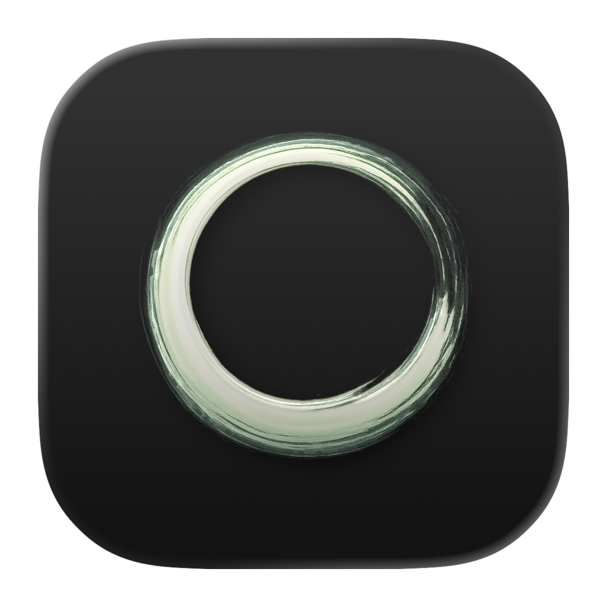

  
  <h1>ZenNotes</h1>
  
<strong>Keyboard-first local Markdown notes with Vim motions, diagrams, daily notes, and first-party MCP integration.</strong>

  
Plain files. Fast editing. One shared core across desktop, self-hosted web, and a planned hosted mode.

  

    <a href="https://zennotes.org">zennotes.org</a>
    ·
    <a href="https://github.com/ZenNotes/zennotes/releases/latest">Download Latest Release</a>
    ·
    <a href="https://github.com/ZenNotes/zennotes">Main Repository</a>
    ·
    <a href="https://discord.gg/W4fWzapKS6">Join Discord</a>
    ·
    <a href="https://github.com/ZenNotes/zennotes/issues">Report an Issue</a>
  

---

  ZenNotes keeps your notes as ordinary local Markdown files and layers on real Vim motions, preview and split workflows,
  math and diagram rendering, tasks, tags, daily notes, search, backlinks, and a bundled MCP server for Claude Code, Claude Desktop, and Codex.

## What Ships Today

- Plain-file vaults — notes are normal `.md` files on disk, no hidden database
- Flexible vault layout — Obsidian-style flat vaults or `inbox/` plus `quick`, `archive`, and `trash` lifecycle areas
- Keyboard-first editing with first-class Vim mode, leader flows, command palette, and pane/tab motion
- CodeMirror 6 editor with live preview behavior, heading folding, outline jumps, wiki links, callouts, tables, and footnotes
- Preview and split modes rendering KaTeX, Mermaid, TikZ, JSXGraph, function-plot, GFM, callouts, footnotes, wiki links, and backlinks
- Tasks, tags, vault-wide text search (built-in, `ripgrep`, or `fzf`), daily notes, archive, trash, and quick capture
- Local files and assets in the vault tree, with reveal-in-Finder / file manager on desktop
- Themes, fonts, typography, keymap overrides, and customizable system-folder labels
- First-party MCP server with desktop install flows for Claude Code, Claude Desktop, and Codex
- Self-hosted Docker deployment with secure-by-default auth, server-backed vault picker, and LAN/home-server access

## Runtimes

ZenNotes ships from one monorepo with one shared app core:

- **Desktop** — Electron shell with native menus, app updater, floating note windows, and signed macOS / Windows / Linux builds
- **Self-hosted** — Vite web client plus a Go server, deployable via Docker on your own machine or home server
- **Hosted** — planned, built on the same web/server stack

## Get ZenNotes

- [Latest desktop release downloads](https://github.com/ZenNotes/zennotes/releases/latest)
- [Source code](https://github.com/ZenNotes/zennotes)
- [Self-hosting and development docs](https://github.com/ZenNotes/zennotes#readme)
- [Community Discord](https://discord.gg/W4fWzapKS6)
